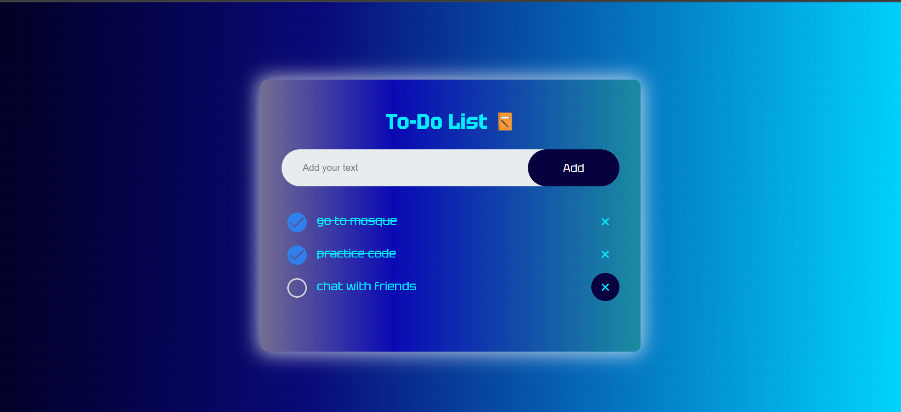
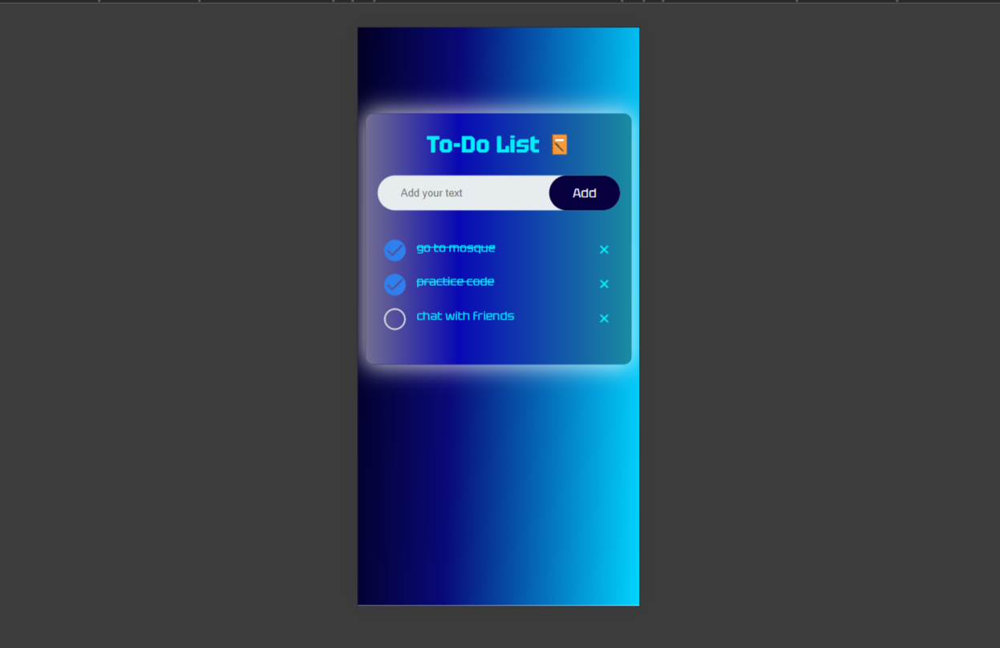

# Todo-List-Project
This is the second weekly task of html, css and Javascript learning from ASTUMSJ-SUMMER BOOTCAMP. This project or task was very help full to understand the basics of html, css and javascript. 
The task is to build a simple responsive todo-app, that adds tasks, deletes tasks and also checkes tasks using javascript dom manipulation concept.

# Final output

> ## Desktop or PC view

> ## Mobile view

## My approach
First I put the html elements and style the html elements using css, then after I tried to make it responsive , I started using the javascript for it's function like addding , deleting , checking and saving current data status.   
